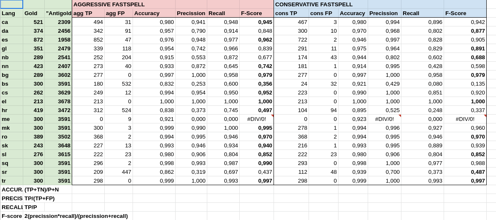

# FastSpell

Targetted language identifier, based on FastText and Hunspell.

## Usage

```
usage: fastspell.py [-h] [--aggr] [--cons] [-q] [--debug] [--logfile LOGFILE]
                    [-v]
                    lang

positional arguments:
  lang

optional arguments:
  -h, --help         show this help message and exit
  --aggr             Aggressive strategy (more positives) (default: False)
  --cons             Conservative strategy (less positives) (default: False)

Logging:
  -q, --quiet        Silent logging mode (default: False)
  --debug            Debug logging mode (default: False)
  --logfile LOGFILE  Store log to a file (default: <_io.TextIOWrapper
                     name='<stderr>' mode='w' encoding='UTF-8'>)
  -v, --version      show version of this script and exit
```

## How it works 

FastSpell will try to determine the language of each sentence in the input by using **[FastText](https://fasttext.cc/)**.

If the language detected is very similar to the target language (i.e. FastText detected Spanish, while the targetted language is Galician), extra checks are performed with **[Hunspell](http://hunspell.github.io/)** to determine the language more precisely.

## Aggressive vs Conservative

FastSpell comes in two flavours: Aggressive and Conservative.

The **Aggressive** version is less hesitant to tag a sentence with the target language, and never has doubts. The **Conservative** version, on the other hand, is more reluctant to tag a sentence with the target language and will use the `unk`(unknown) tag in case of doubt (when there is a tie between the target language and other language, for example)

## Benchmark 


